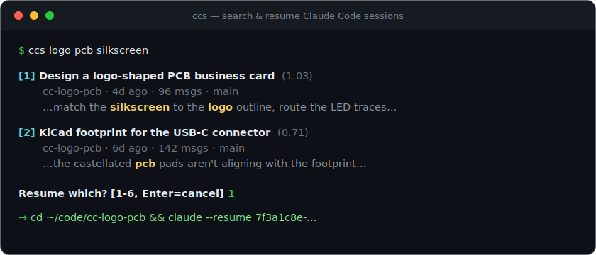

<div align="center">

# ccsearch — search & resume your Claude Code sessions

**Full-text, BM25-ranked search over your entire Claude Code history — then jump back into any conversation in one keystroke.**

[](https://github.com/yaalsn/ccsearch/actions/workflows/ci.yml)
[](https://github.com/yaalsn/ccsearch/releases)
[](LICENSE)
[](https://www.rust-lang.org)

**[🌐 Website](https://yaalsn.github.io/ccsearch/)** · **[⬇ Install](#install)** · **[⭐ Star](https://github.com/yaalsn/ccsearch)**

`ccs <what you remember>` → ranked results → pick one → your shell `cd`s into the project and resumes the session.

<br>



</div>

---

## The problem

Claude Code's built-in `claude --resume` only shows you a list of **AI-generated titles**. If you don't recognize the title, you're stuck scrolling. You *know* you debugged that flaky test / designed that schema / routed that PCB last week — but which session was it?

**ccsearch indexes the full text of every session** — your prompts, Claude's replies, the commands it ran, the files it touched, even subagent transcripts — and ranks matches with **BM25**. Search by what actually happened, not by a title you don't remember.

```console
$ ccs logo pcb silkscreen
[1] Design a logo-shaped PCB business card   (1.03)
    cc-logo-pcb · 4d ago · 96 msgs · main
    …make the silkscreen match the logo outline and route the LED traces around it…
    resume: cd ~/code/cc-logo-pcb && claude --resume 7f3a1c8e-…

Resume which? [1-6, Enter=cancel] 1
# → you're now in ~/code/cc-logo-pcb with the full conversation restored
```

## Features

- 🔎 **Full-text search** over every message, tool call, and file path in your Claude Code history — not just titles.
- 🏆 **BM25 ranking** (SQLite FTS5) with title-weighted scoring, so the most relevant session floats to the top.
- ↩️ **Instant resume** — pick a result and your shell jumps into the session's original directory and runs `claude --resume`, staying there after you quit.
- 🀄 **Chinese / CJK aware** — a custom bigram analyzer means 2-character queries like `检索` work (plain FTS5 can't do this).
- 🧠 **Semantic recall** (`-e`) — can't remember the exact words? An optional, cached Claude Haiku call expands your query with synonyms and related terms, fused with the exact results.
- 🖥️ **Cross-platform, cross-shell** — macOS, Linux, Windows; zsh, bash, fish, PowerShell.
- ⚡ **Single static binary**, no runtime. SQLite (with FTS5) is compiled in. Warm searches are **sub-50ms**.
- 🔒 **100% local** — your sessions never leave your machine. (Semantic mode sends only the short query, never content.)

## Install

### Cargo (any platform)

```bash
cargo install ccsearch          # or: cargo binstall ccsearch
```

### Prebuilt binary

Download from [Releases](https://github.com/yaalsn/ccsearch/releases) and put `ccs` on your `PATH`
(macOS arm64/x86_64, Linux x86_64 gnu/musl, Linux arm64, Windows x86_64).

### Homebrew

```bash
brew install yaalsn/tap/ccsearch   # coming soon
```

## Setup (shell integration)

The directory jump has to happen **in your shell**, so add a tiny function once. `ccs init <shell>` prints it:

```bash
# zsh — ~/.zshrc
eval "$(ccs init zsh)"

# bash — ~/.bashrc
eval "$(ccs init bash)"

# fish — ~/.config/fish/config.fish
ccs init fish | source

# PowerShell — $PROFILE
Invoke-Expression (& ccs init powershell | Out-String)
```

Reload your shell and you're done. (Without it, `ccs` still searches and resumes — your shell just won't stay in the session's directory afterward.)

## Usage

```bash
ccs logo pcb silkscreen       # search everything, ranked; pick a number to resume
ccs 全文 检索                  # Chinese works, including 2-char queries
ccs -e "cut latency"          # semantic recall: expand the query, then fuse
ccs -n 30 docker              # show up to 30 results
ccs --here <query>            # only sessions started in the current directory
ccs --print <query>           # print results, don't prompt
ccs --json <query>            # machine-readable output
ccs --reindex                 # force a full rebuild of the index
```

Each result shows the title, project · relative date · message count · git branch, a highlighted snippet, and the exact resume command.

### Environment

| Variable | Purpose |
|---|---|
| `CCS_IGNORE` | Comma-separated substrings of directories to hide from results (default `/private/tmp/,/tmp/`). |
| `CCS_EXPAND_CMD` | Custom backend for `-e` (reads the prompt on stdin, prints comma-separated terms). Point it at a local LM Studio / Ollama model for fully offline, ~1s expansion. |

## How it works

Every Claude Code session is a JSONL file under `~/.claude/projects/<encoded-cwd>/<session-id>.jsonl`. `ccs`:

1. **Indexes** each session's text (folding in `subagents/*.jsonl`) into a **SQLite FTS5** database at `~/.claude/ccsearch-index.db`. The index refreshes **incrementally on every run** — only changed files are re-parsed — so results are always current. First run indexes everything (~2s); warm searches are ~30ms.
2. **Ranks** with BM25, column-weighted title/prompt/body 100/10/1 so a title hit beats a body hit even for common terms; scores are normalized per query with a small recency tiebreak.
3. **Resumes** by re-encoding the correct launch directory (the one `claude --resume` needs to locate the session) and handing the shell function a `cd` + `claude --resume`.

### Why CJK needs special handling

FTS5's tokenizers can't do Chinese substring search — `trigram` needs ≥3 characters and `unicode61` treats a whole run of Han characters as one token. So `ccs` runs its own analyzer at index *and* query time: CJK runs become overlapping **bigrams** (`全文检索` → `全文 文检 检索`), so a 2-character query matches; ASCII stays whole words and is queried as a prefix (`airwall` → `airwallex`).

## ccsearch vs `claude --resume`

| | `claude --resume` | **ccsearch** |
|---|---|---|
| Find by | AI title only | full text: prompts, replies, commands, files, subagents |
| Ranking | recency list | BM25 relevance |
| Chinese/CJK | — | ✅ 2-char queries |
| Semantic recall | — | ✅ optional (`-e`) |
| Jumps to project dir | — | ✅ |

## FAQ

**Does it send my code or conversations anywhere?** No. Indexing and search are entirely local. The only thing that ever leaves your machine is the short query text you pass to `-e` (and only if you use it).

**Do I need an API key?** No. Search needs nothing but the binary. Semantic mode (`-e`) reuses your existing `claude` CLI login, or any local model via `CCS_EXPAND_CMD`.

**Where's the index stored?** `~/.claude/ccsearch-index.db`. Delete it anytime; it rebuilds from your sessions.

## Contributing

Issues and PRs welcome. `cargo test` and `cargo clippy --all-targets -- -D warnings` must pass (CI enforces both on macOS, Linux, and Windows).

## License

MIT © 2026
